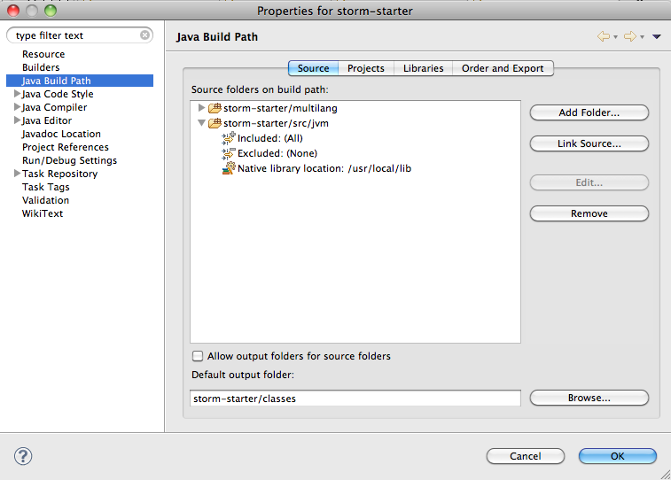

This page outlines how to set up a Storm project for development. The steps are:

1. Add Storm jars to classpath
2. Set up native load path
3. If using multilang, add multilang dir to classpath

Follow along to see how to set up the [storm-starter](http://github.com/nathanmarz/storm-starter) project in Eclipse.

### Add Storm jars to classpath

You'll need the Storm jars on your classpath to develop Storm topologies. Using [[Maven]] is highly recommended.

[storm-starter](http://github.com/nathanmarz/storm-starter) uses [Leiningen](http://github.com/technomancy/leiningen) for build and dependency resolution. You can install leiningen by downloading [this script](https://raw.github.com/technomancy/leiningen/stable/bin/lein), placing it on your path, and making it executable. To retrieve the dependencies for Storm, simply run `lein deps` in the project root.

To set up the classpath in Eclipse, create a new Java project, include `src/jvm/` as a source path, and make sure all the jars in `lib/` and `lib/jvm/` are in the `Referenced Libraries` section of the project.

### Set up native load path

Storm uses a few native libraries which you installed in [[Setting up a development environment]]. When running your topologies in local mode, you'll need to make sure that the `java.library.path` setting on the JVM is set to the location of the native libraries. You can do this in Eclipse by going to the Project properties and setting the native library location under `storm-starter/src/jvm`. It looks like this:

On Macs, the native libraries are located at `/usr/local/lib`. 

### If using multilang, add multilang dir to classpath

If you implement spouts or bolts in languages other than Java, then those implementations should be under the `multilang/resources/` directory of the project. For Storm to find these files in local mode, the `multilang/` dir needs to be on the classpath. You can do this in Eclipse by adding `multilang/` as a source folder.

For more information on writing topologies in other languages, see [[Using non-JVM languages with Storm]].

To test that everything is working in Eclipse, you should now be able to `Run` the `WordCountTopology.java` file. You will see messages being emitted at the console for 10 seconds.
